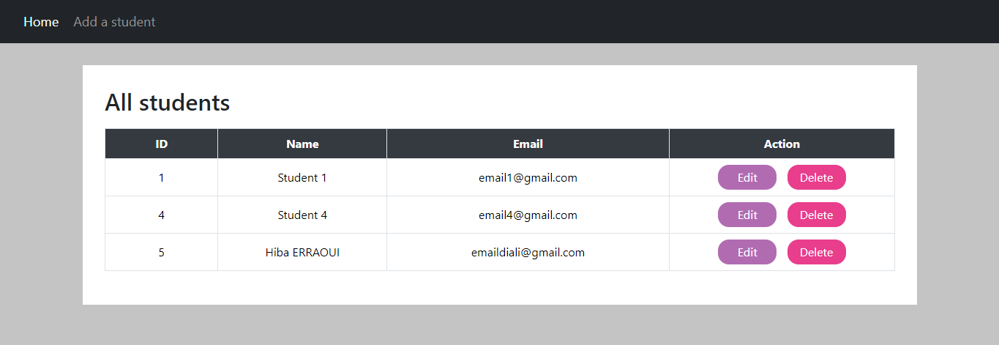
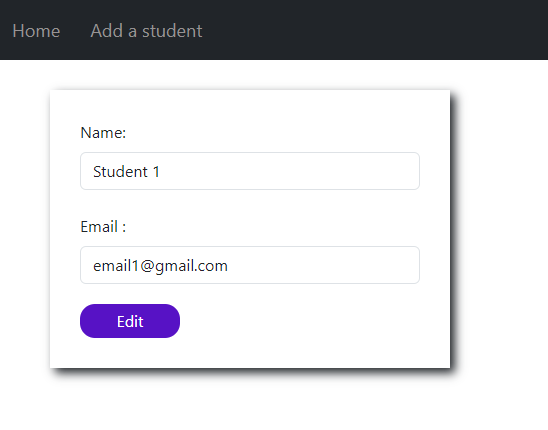
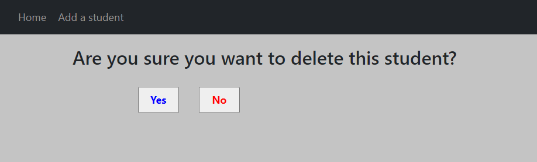
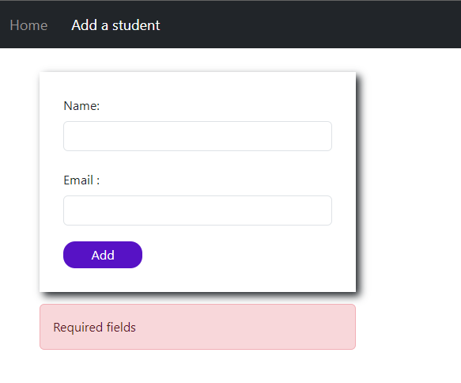

## Description
This repository contains a PHP project for managing student information using MySQL database with CRUD (Create, Read, Update, Delete) operations.  
The project includes multiple files:  
♡ &nbsp; [add.php](add.php) : Allows creating a new student record in the database.  
♡ &nbsp; [index.php](index.php) : Displays a table with a list of all students in the database.  
♡ &nbsp; [edit.php](edit.php) : Allows editing student information.  
♡ &nbsp; [delete.php](delete.php) : Allows deleting a student record with a confirmation message.  
♡ &nbsp; [db.php](db.php) : Handles database connection.  
♡ &nbsp; [header.php](header.php) : Displays a navigation menu with links to home and add student pages.  
♡ &nbsp; [create_db.sql](create_db.sql) : Initializes the 'mydb' database and 'student' table, and inserts sample student records.

The project demonstrates the use of PHP Data Object (PDO) for database operations and integrates with Bootstrap for styling.

## Screenshots

